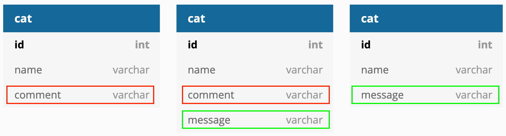

# Use cases

Common cases include:

* Adding/removing a new column
* Renaming a column
* Changing the column type

Things to consider:

* Some operations may not be **backward-compatible**.
* Transformations are easier without the `NOT NULL` constraints.
* When removing something that is "not used by anything" need to check if a use case exists in client 
code.

## Offline vs online

Migrations seem trivial to run offline but what about running them in production? Imagine doing this on
customer-facing systems that should have minimal downtime.

How to do handle migrations in such a system is complex, but possible if **split into multiple steps**:

* Have a bunch of instances of your subsystems (apps, databases)
* For each instance in turn: shut down / update / restart
* While doing this, we will be running an instance of the old and the new _in parallel_.
    * This needs to be done in a way that the old and the new versions of the application can work
    with the database.
    * All migrations need to be backwards compatible.
* In the end we will end up with only the new versions of the app and database.
    
NOTE: renaming or deleting a column in _not_ backwards-compatible.

## Example

### Add a "comment" column to the "cat" table

Simple - add a column to the ORM and run the auto migration command. Looking at the generated script
there should be a forward and backward migration, adding/deleting the new column.

### Rename column "comment" to "message".

 
1. Add a new column `message`, that can be `NULL`.
2. Copy data from the old column to the new.
3. To avoid losing data - add database triggers to keep these in sync, or do this programatically
4. Update the app to use the new column  <-- the most complicated part
5. Free to delete the old column
6. Free to set the new column to `NOT NULL` if needed.

### Change the type of a column.

For example: we had a column "size" with string values "small", "medium", "large". Need to convert this 
from string to integer values (enumerated).

The steps would be very similar to the previous example.

### Data migration - backup / transfer

Typical when moving between databases or provisioning your database with data from a certain state. You will need to
read in data in the migration file and commit the changes as you would in regular Python code. You can read new data 
from a file dump, from a network connection, or even from another database connection. 

Make sure to include data deletion in the down migration for backwards-compatibility.

See: [example](../migrations/versions/2aec8bdecc20_read_in_some_cats.py) with adding some cat names to our example table
